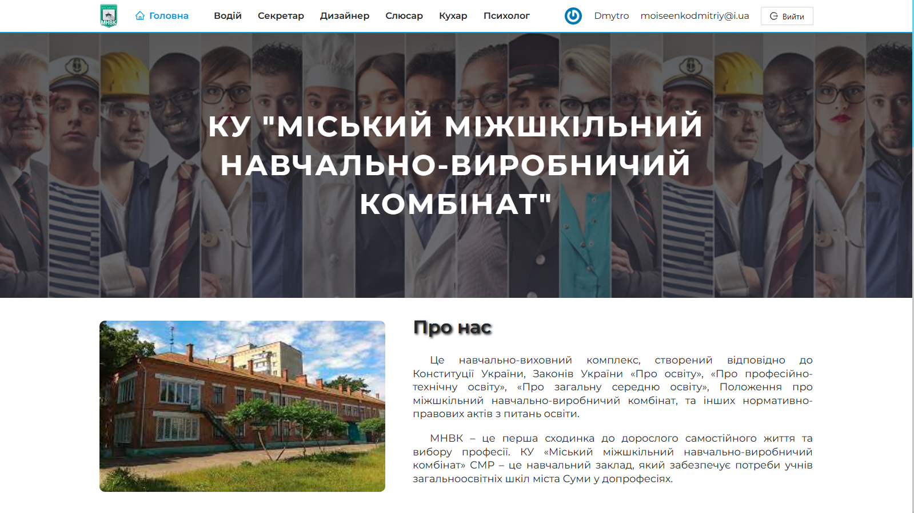

# ММНВК

## Опис проекту

`ММНВК:` Ресурс для Міжшкільного Навчального Комбінату, який надасть учням 10-11
класів можливість систематичного вивчення лекційного матеріалу та проходження
атестацій у обраній ними професії.

`Основні функції:`

- Реєстрація та Авторизація.
- Загальна інформація про навчальний заклад, його історія, інформація про
  вчителів і персонал, та коротко про професії.
- Окремі сторінки для кожної професії з описом, лекційним матеріалом, галереєю
  зображень та атестаційним завданням.
- Блок атестації представлений у вигляді тестів з однією вірною відповіддю і
  автоматичним результатом в кінці тестування.

`Посилання на сайт:` https://mnvk.vercel.app
